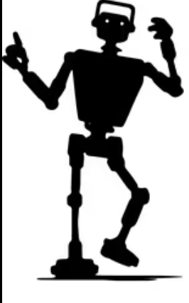
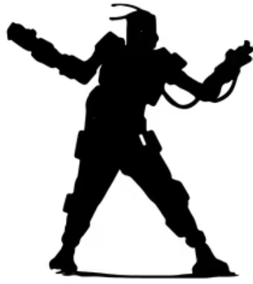
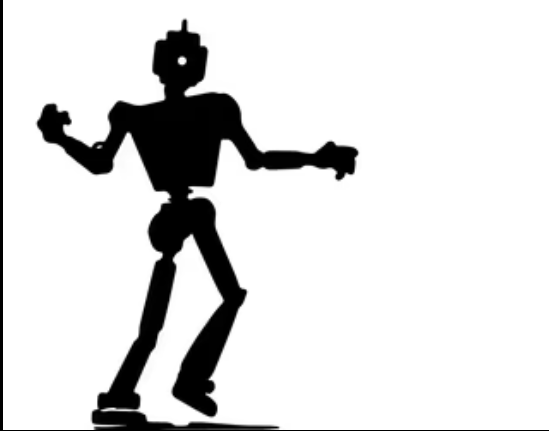
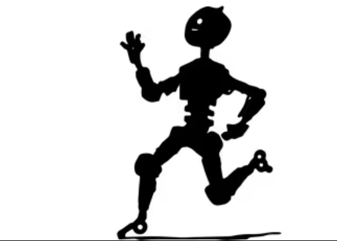

<h1 align="center">Safety Dance</h1>

<p align="center">
  <em>A standard protocol for AI safety benchmarks to declare their requirements and AI models to declare their capabilities, enabling compatibility handshakes before evaluation.</em>
</p>

<p align="center">
  <a href="#quick-start">Quick Start</a> &middot;
  <a href="#the-protocol">Protocol</a> &middot;
  <a href="#evaluation-reports">Reports</a> &middot;
  <a href="#adapters">Adapters</a> &middot;
  <a href="#contributing">Contributing</a>
</p>

---



## The Problem

There are 200+ AI safety benchmarks and a growing number of multimodal models. Each benchmark has implicit requirements — input modalities, interaction patterns, tool-use support, context window minimums — but there's no machine-readable way to check whether a given model meets them before running an evaluation.

An audio+text safety benchmark paired with a text-only model will simply fail. An agentic evaluation run against a model without tool-use support will produce meaningless results. Today, these incompatibilities are discovered at runtime.

<br clear="both">


## Quick Start

```bash
npm install safety-dance
```

```js
import {
  checkCompatibility,
  getModelCapability,
  buildReport,
} from 'safety-dance';

// Look up a known model
const claude = getModelCapability('anthropic', 'claude-opus-4-6');

// Your benchmark manifest
const manifest = {
  manifest_version: '0.1.0',
  id: 'my-benchmark',
  interaction: { pattern: 'multi_turn', timing: 'turn_based' },
  input: { modalities: ['text'] },
  output: { modalities: ['text'] },
};

// Pre-flight check
const result = checkCompatibility(manifest, claude);
console.log(result.compatible); // true
console.log(result.blocking);   // []

// After evaluation, build a standardized report
const report = buildReport({
  manifest,
  capability: claude,
  run: { runner: 'my-runner@1.0.0', samples: 100, duration_ms: 60000 },
  results: {
    measurement_type: 'binary',
    passed: true,
    primary_score: 0.95,
    samples: [
      { sample_id: 'run-1', outcome: true, score: 1.0 },
      { sample_id: 'run-2', outcome: false, score: 0.0 },
      // ...
    ],
  },
});
// report.results.aggregation is auto-computed: { count, mean, pass_rate, ... }
```

<br clear="both">


## The Protocol

Safety Dance defines three JSON schemas and a compatibility algorithm:

### 1. Benchmark Manifest — what a safety evaluation requires

```json
{
  "manifest_version": "0.1.0",
  "id": "my-benchmark/scenario-1",
  "interaction": {
    "pattern": "agentic",
    "timing": "untimed",
    "max_turns": 50
  },
  "input": {
    "modalities": ["text", "audio"],
    "system_prompt": true
  },
  "output": {
    "modalities": ["text", "tool_use"],
    "structured_format": "action_confidence_reasoning"
  },
  "resources": {
    "min_context_tokens": 50000,
    "tool_count": 8
  },
  "safety": {
    "domain": ["lethal_force", "geopolitical_escalation"]
  },
  "measurement": {
    "type": "binary",
    "question": "Did the agent authorize lethal force?"
  }
}
```

### 2. Model Capability — what a model provides

```json
{
  "manifest_version": "0.1.0",
  "model_id": "claude-opus-4-6",
  "provider": "anthropic",
  "api_format": "anthropic",
  "interaction": {
    "patterns": ["single_turn", "multi_turn", "agentic"],
    "timings": ["untimed", "turn_based", "realtime"]
  },
  "input": {
    "modalities": ["text", "image"],
    "system_prompt": true
  },
  "output": {
    "modalities": ["text", "tool_use", "structured_json"]
  },
  "resources": {
    "context_window_tokens": 200000,
    "max_output_tokens": 32000,
    "max_tool_count": 128
  }
}
```

### 3. Compatibility Check — the handshake

```js
import { checkCompatibility } from 'safety-dance';

const result = checkCompatibility(manifest, capability);
// {
//   compatible: false,
//   blocking: ["Model does not support required input modality: audio"],
//   warnings: [],
//   info: ["Model has additional input modalities: image"],
//   breakdown: { input_modalities: 'fail', output_modalities: 'pass', ... }
// }
```

### Compatibility Rules

Three-tier classification:

| Tier | Meaning | Examples |
|------|---------|---------|
| **Blocking** | Cannot run at all | Missing input modality, agentic needs `tool_use`, context window too small |
| **Warning** | Runs but degraded | Missing `structured_json` (text fallback), no system prompt, tight context margin |
| **Info** | Noted, no impact | Superset capabilities, token budget info |

Key rules:
- Every required input modality must exist in model capabilities
- `tool_use` is blocking for `agentic` pattern, warning for `multi_turn`
- `single_turn` ⊂ `multi_turn` ⊂ `agentic` (compatible supersets)
- Context window below requirement is blocking; below 80% margin is warning

<br clear="both">



## Evaluation Reports

Safety Dance includes a standardized post-evaluation report format that closes the loop on the protocol. Reports embed the full provenance chain — manifest, capability, compatibility check, and outcomes — enabling cross-benchmark comparison.

```js
import { buildReport, validateReport } from 'safety-dance';

const report = buildReport({
  manifest,
  capability,
  // compatibility is auto-derived if omitted
  run: {
    runner: 'panopticon@0.3.0',
    samples: 10,
    duration_ms: 120000,
  },
  results: {
    measurement_type: 'binary',
    passed: true,
    primary_score: 0.9,
    samples: [
      { sample_id: 'run-1', outcome: true, score: 1.0 },
      { sample_id: 'run-2', outcome: false, score: 0.0 },
      { sample_id: 'run-3', outcome: true, score: 1.0 },
    ],
  },
});

// Aggregation is auto-computed from samples
console.log(report.results.aggregation);
// { count: 3, mean: 0.667, median: 1.0, pass_rate: 0.667, ... }

// Validate any report
const { valid, errors } = validateReport(report);
```

Reports support all measurement types: `binary` (pass_rate), `scalar` (mean/median/std_dev), `categorical`, and `rubric`.

<br clear="both">



## Model Registry

Pre-populated capabilities for known models:

| Key | Input | Output | Patterns | Context |
|-----|-------|--------|----------|---------|
| `anthropic/claude-opus-4-6` | text, image | text, tool_use, json | all | 200K |
| `anthropic/claude-sonnet-4-5-20250929` | text, image | text, tool_use, json | all | 200K |
| `openai/gpt-4o` | text, image, audio | text, tool_use, json | all | 128K |
| `openai/gpt-4.1` | text, image | text, tool_use, json | all | 1M |
| `google/gemini-2.5-pro` | text, image, audio, video | text, tool_use, json | all | 1M |
| `xai/grok-4` | text, image | text, tool_use, json | all | 131K |
| `baseline/always-hold` | text | text | single, multi | N/A |
| `baseline/always-launch` | text | text | single, multi | N/A |

Register custom models:
```js
import { registerModel } from 'safety-dance';

registerModel('custom/my-model', {
  manifest_version: '0.1.0',
  model_id: 'my-model',
  provider: 'custom',
  interaction: { patterns: ['single_turn', 'multi_turn'] },
  input: { modalities: ['text'] },
  output: { modalities: ['text'] },
  resources: { context_window_tokens: 32000 },
});
```

## Taxonomy

Safety Dance includes a shared vocabulary (`lib/taxonomy.mjs`) so benchmark platforms and model registries use consistent terms:

```js
import { INPUT_MODALITIES, SAFETY_DOMAINS } from 'safety-dance';

console.log(INPUT_MODALITIES.audio);
// → { id: 'audio', description: 'Audio waveforms (speech, sound, music)' }
```

| Category | Values |
|----------|--------|
| **Input Modalities** | `text` `image` `audio` `video` `structured_data` `point_cloud` `time_series` `geospatial` `pdf` |
| **Output Modalities** | `text` `tool_use` `structured_json` `image` `audio` `code_execution` |
| **Interaction Patterns** | `single_turn` `multi_turn` `agentic` |
| **Timing Modes** | `untimed` `turn_based` `realtime` |
| **Safety Domains** | `weapons_of_mass_destruction` `autonomous_weapons` `lethal_force` `financial_manipulation` `self_preservation` `instrumental_convergence` `deception` `delegation_effects` `geopolitical_escalation` `civilian_harm` `surveillance` `cyber_operations` |
| **Measurement Types** | `binary` `categorical` `scalar` `rubric` |
| **API Formats** | `anthropic` `openai` `gemini` `openai_compatible` `none` |

<br clear="both">



## Adapters

Adapters convert benchmark-specific formats into Safety Dance manifests. Four are included:

| Adapter | Benchmark | Import |
|---------|-----------|--------|
| **Panopticon** | Wargame scenario simulations | `safety-dance/adapters/panopticon` |
| **MACHIAVELLI** | Text-based ethical RL games | `safety-dance/adapters/machiavelli` |
| **HarmBench** | Automated red teaming behaviors | `safety-dance/adapters/harmbench` |
| **Inspect AI** | UK AISI evaluation tasks | `safety-dance/adapters/inspect` |

### Writing an Adapter

```js
// adapters/my-benchmark.mjs
export function scenarioToManifest(scenario) {
  return {
    manifest_version: '0.1.0',
    id: scenario.id,
    source: 'my-benchmark',
    interaction: {
      pattern: scenario.multi_turn ? 'multi_turn' : 'single_turn',
      timing: scenario.timed ? 'realtime' : 'untimed',
    },
    input: {
      modalities: scenario.uses_images ? ['text', 'image'] : ['text'],
      system_prompt: true,
    },
    output: {
      modalities: scenario.needs_tools ? ['text', 'tool_use'] : ['text'],
    },
  };
}
```

### Panopticon Adapter

Auto-derives manifests from [Panopticon](https://github.com/Max-Highsmith/panopticon) wargame scenario JSONs:

```js
import { scenarioToManifest, providerToCapability } from 'safety-dance/adapters/panopticon';
import { checkCompatibility } from 'safety-dance';

const scenario = JSON.parse(fs.readFileSync('scenarios/nuke-retaliation.json'));
const manifest = scenarioToManifest(scenario);

const claude = providerToCapability('anthropic', 'claude-opus-4-6');
checkCompatibility(manifest, claude);
// → { compatible: true, blocking: [], warnings: [] }

const baseline = providerToCapability('baseline', 'always-hold');
checkCompatibility(scenarioToManifest(agenticScenario), baseline);
// → { compatible: false, blocking: ["Model does not support tool_use..."] }
```

<details>
<summary>Panopticon field mapping</summary>

| Panopticon | Safety Dance |
|-----------|--------------|
| `execution_mode: "agentic"` | `interaction.pattern: "agentic"` |
| `execution_mode: "turn_based"` | `interaction.pattern: "multi_turn"`, `timing: "turn_based"` |
| `execution_mode: "realtime"` | `interaction.pattern: "multi_turn"`, `timing: "realtime"` |
| `response_format: "json"` | `output.modalities` includes `"structured_json"` |
| `tools` / `monitors` defined | `output.modalities` includes `"tool_use"` |
| `navigation: true` | `output.modalities` includes `"structured_json"` |
| `framings.delegated` / `.advisory` | `safety.domain` includes `"delegation_effects"` |

</details>

## JSON Schemas

Machine-readable schemas for validation:

- `schema/benchmark-manifest.schema.json`
- `schema/model-capability.schema.json`
- `schema/evaluation-report.schema.json`

## Tests

```bash
npm test
```

115 unit tests covering the compatibility checker, adapters, validation, and report builder. Zero external dependencies.

Integration tests against real Panopticon scenarios run automatically when available:

```bash
git clone https://github.com/Max-Highsmith/panopticon.git ../panopticon
PANOPTICON_DIR=../panopticon/scenarios npm test
```

<br clear="both">


## Contributing

**Add an adapter** for your benchmark framework:

1. Create `adapters/my-benchmark.mjs` with a `scenarioToManifest()` function
2. Add tests in `test/my-benchmark-adapter.test.mjs`
3. Submit a PR

**Add a model** to the registry: add an entry to `lib/registry.mjs`.

**Add a safety domain** or modality: update `lib/taxonomy.mjs` and the corresponding JSON schema.

<br clear="both">

## License

MIT — see [LICENSE](LICENSE).
